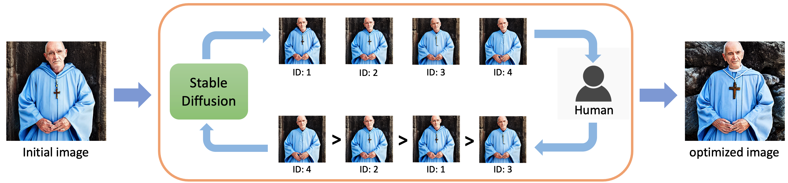

# Taming Stable Diffusion with Human Ranking Feedback

This is the official repo for the paper "Zeroth-Order Optimization Meets Human Feedback: Provable Learning via  Ranking Oracles" Tang et al.

## Intro

In this work, we invent a new zero order optimization algorithm that can optimize any function via only its ranking oracle. More importantly, we successfully apply our algorithm to a novel application shown in the following figure, where we optimize the latend embedding of Stable Diffusion with human ranking feedback. Specifically, starting from the latent embedding of an initial image, we first perturbed the embedding with multiple random noise vectors and then use Stable Diffusion to generate multiple simialr images (only differ in details). Then we ask some human evaluator (ourselves actually) to rank those generated image. Finally, our algorithm will update the latent embedding based on the ranking information. **Notice: our method do not require any training or finetuning at all!**. From our experience, usually it takses around 10-20 rounds of ranking feedback before obtaining image with satisfying details.

## Some examples

We provide some examples below, where the column under "Human" meaning the images obtained by optimizing human preference, while the column under "CLIP" meaning the ones by optimizing CLIP score. We use some popular prompts from this website https://mpost.io/best-100-stable-diffusion-prompts-the-most-beautiful-ai-text-to-image-prompts . More examples can be found in the paper

## Running our code

Our main code is provided as the ipynb script: stable_diffusion_alignment.ipynb

To run our code, you should first install Stable Diffusion properly following the guidance in https://github.com/CompVis/stable-diffusion .

We actually use the Oneflow version of Stable Diffusion in our implementation https://github.com/Oneflow-Inc/diffusers/tree/oneflow-fork, as we found that it can generate much faster than the official implementation.

## ToDo

- [ ] Intergate it into Stable Diffusion Webui

## Cite

If our work is useful for you, please cite our paper

